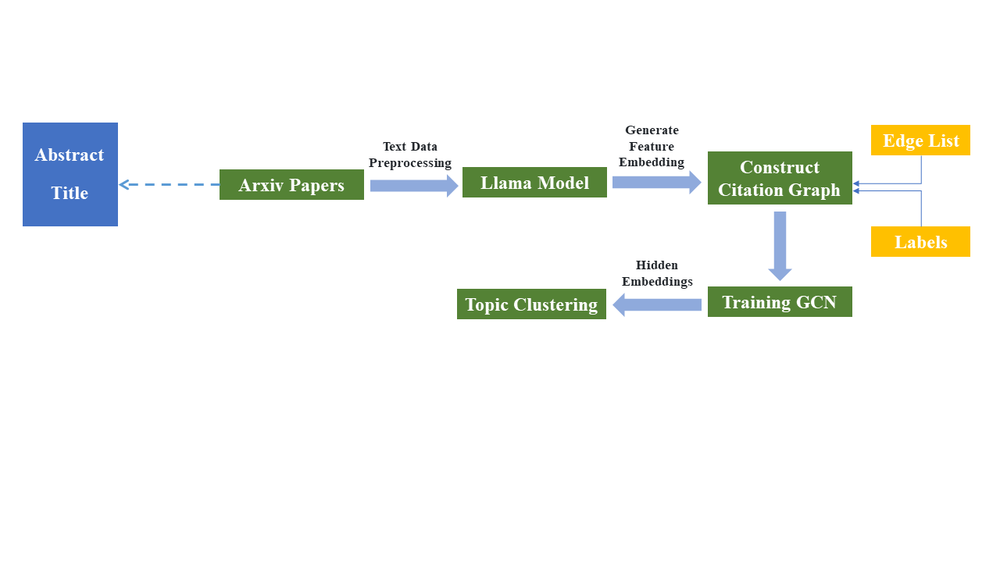

## Table of Contents

- [Overview](#overview)
- [Features](#features)
- [Installation](#installation)
- [Usage Instructions](#usage-instructions)
  - [1. Create a Subgraph](#1-create-a-subgraph)
  - [2. Preprocess Text Data (Abstracts & Titles)](#2-preprocess-text-data-abstracts--titles)
  - [3. Generate Embeddings](#3-generate-embeddings)
  - [4. Train GCN and Perform K-Means Clustering](#4-train-gcn-and-perform-k-means-clustering)
  - [5. Perform LDA-based Clustering](#5-perform-lda-based-clustering)
- [Model Architecture](#model-architecture)  
- [Visualization](#visualization)


## Overview

The **arxiv GNN Project** leverages Graph Convolutional Networks (GCN) and topic modeling (LDA) to perform node classification and clustering on the arxiv dataset. The pipeline includes data preprocessing, embedding generation using Hugging Face's LLaMa models, model training, clustering, evaluation, and visualization.

## Features

- **Data Preprocessing**: Cleans and prepares raw data.
- **Embedding Generation**: Utilizes LLaMa models for generating node embeddings.
- **GCN Training**: Trains a GCN for node classification.
- **Clustering**: Implements K-Means and LDA-based clustering.
- **Evaluation & Visualization**: Assesses and visualizes clustering performance.
- **Resume Capability**: Ensures embedding generation can resume from interruptions.

## Installation

To set up the project and install the required dependencies, follow these steps:

### 1. Clone the Repository

Clone the project repository using the following command:

```bash
git clone https://github.com/Hossein1998/arxiv-GCN-TopicClustering.git
cd arxiv-GCN-TopicClustering
```

### 2. Install Dependencies

Install the required Python packages using pip:

```bash
pip install -r requirements.txt
```

## Usage Instructions

### 1. create-a-subgraph
When working with graphs that have multiple disconnected components, analyzing the largest connected component ensures more accurate results for tasks like clustering and classification, as smaller disconnected components might lead to irrelevant or misleading outcomes. Removing these smaller components and noise helps in obtaining cleaner, more reliable data. Additionally, focusing on the largest connected component optimizes computational resources by reducing complexity, making the analysis more efficient and faster, especially when computational resources are limited.

Run:
```bash
python create_subgraph.py
```

### 2. Preprocess Text Data (Abstracts & Titles)

- Remove missing values from key columns (title, abstract).
- Perform text cleaning (lowercasing, removing punctuation, etc.).
- Filter and subset data based on valid node IDs.
- Save the preprocessed data for further use.

Run:
```bash
python preprocess_text_data.py
```

### 3. Generate Embeddings

- Load **LLaMA model**.
- Generate **title and abstract embeddings** for each paper.
- Save embeddings and processed graph data for future use.

Run:
```bash
python generate_embeddings.py
```

### 4. Train GCN and Perform K-Means Clustering

- Load **title and abstract embeddings** along with graph data.
- Train a **Graph Convolutional Network (GCN)** for node classification.
- Use **early stopping** and validation accuracy to select the best model.
- Extract **hidden embeddings** for downstream clustering tasks.
- Apply **K-Means clustering** to the embeddings.
- Evaluate clustering quality using metrics like **Silhouette Score**, **Davies-Bouldin Index**, **Adjusted Rand Index**, and **Normalized Mutual Information**.
- Visualize the clustering results using **t-SNE**.

Run:
```bash
python gnn_training_kmeans_clustering.py
```

### 5. Perform LDA-based Clustering

- **Load and preprocess** the dataset (e.g., title and abstract).
- **Train an LDA model** to perform topic modeling on the dataset.
- **Assign topics** to each document based on the highest probability.
- **Reduce dimensions** using TruncatedSVD for further analysis.
- **Evaluate clustering quality** using metrics like Silhouette Score, Davies-Bouldin Index, and Adjusted Rand Index.
- **Visualize results** with t-SNE and save the clustering results.

Run:
```bash
python LDA_clustering.py
```

### 5. LDA-based Clustering

- Apply **Latent Dirichlet Allocation (LDA)** to cluster papers based on **title and abstract**.
- Reduce dimensionality using **TruncatedSVD** for better clustering performance.
- Assign topics to each document based on the **highest probability**.
- Evaluate clustering results and visualize topic distributions.

Run:
```bash
python lda_clustering.py
```

## Model Architecture




## Visualization
