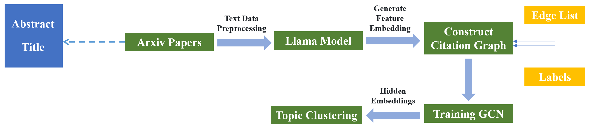
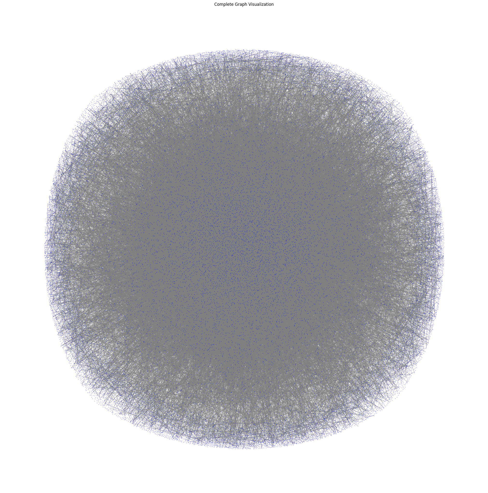
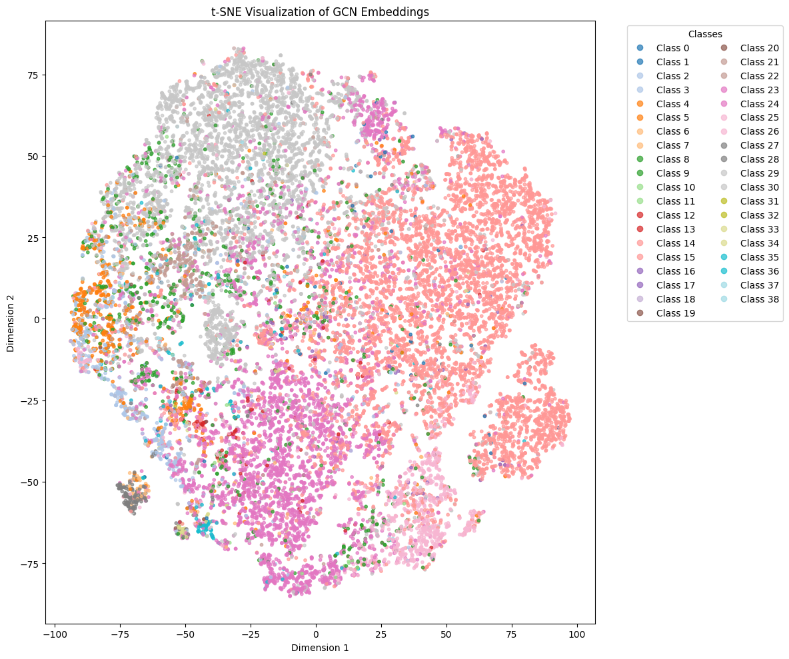
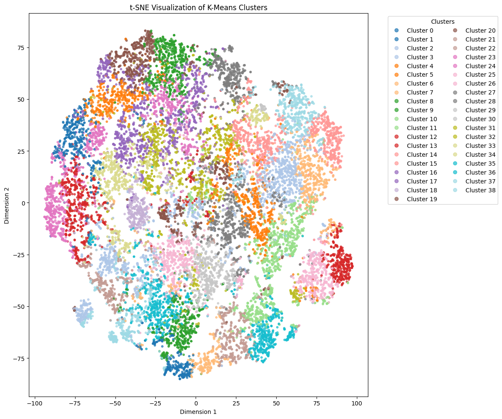
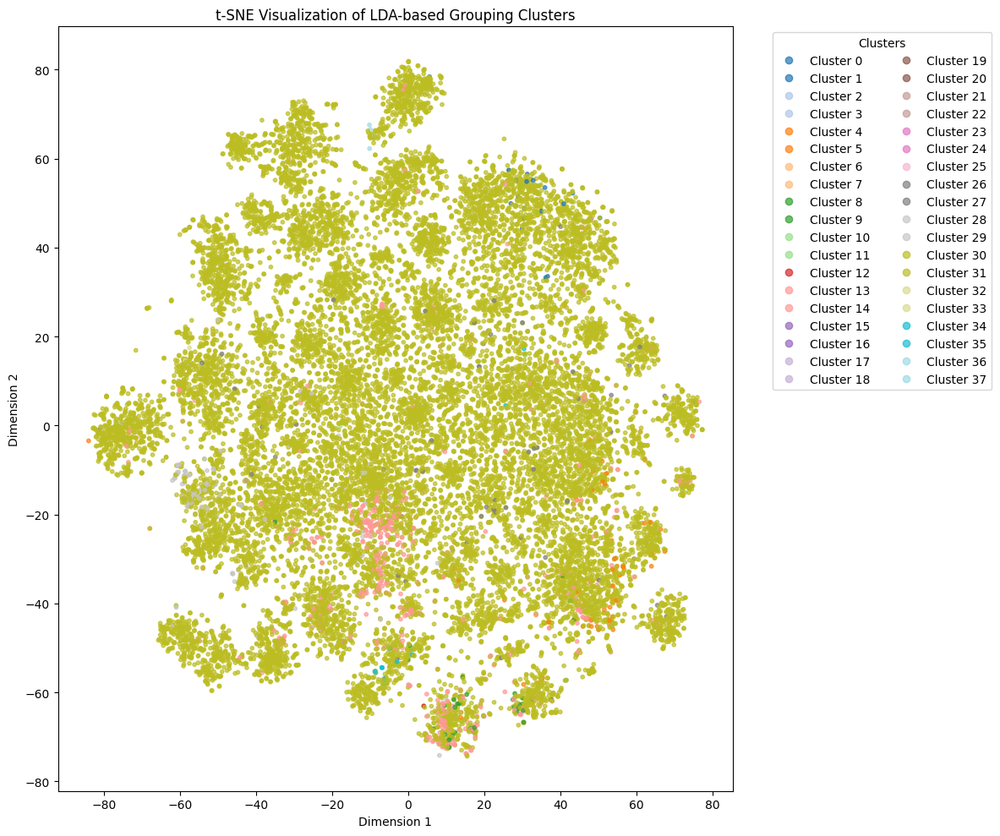

## Table of Contents

- [Overview](#overview)
- [Features](#features)
- [Installation](#installation)
- [Usage Instructions](#usage-instructions)
  - [1. Create a Subgraph](#1-create-a-subgraph)
  - [2. Preprocess Text Data (Abstracts & Titles)](#2-preprocess-text-data-abstracts--titles)
  - [3. Generate Embeddings](#3-generate-embeddings)
  - [4. Train GCN and Perform K-Means Clustering](#4-train-gcn-and-perform-k-means-clustering)
  - [5. Perform LDA-based Clustering](#5-perform-lda-based-clustering)
- [Model Architecture](#model-architecture)  
- [Visualization](#visualization)
- [Results and Analysis](#results-and-analysis)


## Overview

The **arxiv GNN Project** leverages Graph Convolutional Networks (GCN) and topic modeling (LDA) to perform node classification and clustering on the arxiv dataset. The pipeline includes data preprocessing, embedding generation using Hugging Face's LLaMa models, model training, clustering, evaluation, and visualization.

## Features

- **Data Preprocessing**: Data Preprocessing: Cleans and prepares raw data by creating a subgraph that isolates the largest connected component, removing smaller components and noise for more accurate and efficient analysis.
- **Embedding Generation**: Utilizes LLaMa models for generating node embeddings.
- **GCN Training**: Trains a GCN for node classification.
- **Clustering**: Implements K-Means and LDA-based clustering.
- **Evaluation & Visualization**: Assesses and visualizes clustering performance.
- **Resume Capability**: Ensures embedding generation can resume from interruptions.

## Installation

To set up the project and install the required dependencies, follow these steps:

### 1. Clone the Repository

Clone the project repository using the following command:

```bash
git clone https://github.com/Hossein1998/arxiv-GCN-TopicClustering.git
cd arxiv-GCN-TopicClustering
```

### 2. Install Dependencies

Install the required Python packages using pip:

```bash
pip install -r requirements.txt
```

## Usage Instructions

### 1. create-a-subgraph
When working with graphs that have multiple disconnected components, analyzing the largest connected component ensures more accurate results for tasks like clustering and classification, as smaller disconnected components might lead to irrelevant or misleading outcomes. Removing these smaller components and noise helps in obtaining cleaner, more reliable data. Additionally, focusing on the largest connected component optimizes computational resources by reducing complexity, making the analysis more efficient and faster, especially when computational resources are limited.

Run:
```bash
python create_subgraph.py
```

### 2. Preprocess Text Data (Abstracts & Titles)

- Remove missing values from key columns (title, abstract).
- Perform text cleaning (lowercasing, removing punctuation, etc.).
- Filter and subset data based on valid node IDs.
- Save the preprocessed data for further use.

Run:
```bash
python preprocess_text_data.py
```

### 3. Generate Embeddings

- Load **LLaMA model**.
- Generate **title and abstract embeddings** for each paper.
- Save embeddings and processed graph data for future use.

Run:
```bash
python generate_embeddings.py
```

### 4. Train GCN and Perform K-Means Clustering

- Load **title and abstract embeddings** along with graph data.
- Train a **Graph Convolutional Network (GCN)** for node classification.
- Use **early stopping** and validation accuracy to select the best model.
- Extract **hidden embeddings** for downstream clustering tasks.
- Apply **K-Means clustering** to the embeddings.
- Evaluate clustering quality using metrics like **Silhouette Score**, **Davies-Bouldin Index**, **Adjusted Rand Index**, and **Normalized Mutual Information**.
- Visualize the clustering results using **t-SNE**.

Run:
```bash
python gnn_training_kmeans_clustering.py
```

### 5. Perform LDA-based Clustering

- **Load and preprocess** the dataset (e.g., title and abstract).
- **Train an LDA model** to perform topic modeling on the dataset.
- **Assign topics** to each document based on the highest probability.
- **Reduce dimensions** using TruncatedSVD for further analysis.
- **Evaluate clustering quality** using metrics like Silhouette Score, Davies-Bouldin Index, and Adjusted Rand Index.
- **Visualize results** with t-SNE and save the clustering results.

Run:
```bash
python LDA_clustering.py
```

## Model Architecture




## Visualization


### Citation Network
This visualization shows the complete **citation network**, where nodes represent research papers, and edges represent citation links between them. The graph structure provides the foundation for further processing and analysis.



### t-SNE Visualization of GCN Embeddings
This visualization shows the **t-SNE** plot of the embeddings generated by the **Graph Convolutional Network (GCN)**. Each point represents a paper, colored by its class. It helps to visualize the learned representations in 2D space.



### t-SNE Visualization of K-Means Clusters
This plot illustrates the **t-SNE** visualization of **K-Means clustering** results. Each paper is assigned to one of the clusters, and this diagram shows how well the K-Means algorithm grouped the papers.



### t-SNE Visualization of LDA-based Grouping Clusters
Here we see the **t-SNE** visualization of clustering results based on **LDA (Latent Dirichlet Allocation)**. This clustering uses the title and abstract embeddings for grouping papers into topics.



## Results and Analysis


### Clustering Performance Metrics

| Metric                          | GCN-based K-Means Clustering | LDA-based Grouping |
|---------------------------------|------------------------------|---------------------|
| **Silhouette Score**            | 0.1315                       | -0.2360            |
| **Davies-Bouldin Index**        | 1.6187                       | 2.5649             |
| **Adjusted Rand Index (ARI)**   | 0.0987                       | -0.0002             |
| **Normalized Mutual Information (NMI)** | 0.3258                | 0.0056             |

---

Based on the updated results, **GCN-based K-Means Clustering** performs significantly better than **LDA-based Grouping**:
- The **Silhouette Score** for **GCN-based K-Means** is positive (0.1315), indicating better cohesion and separation of clusters, while LDA-based grouping has a negative score.
- **GCN-based K-Means** also has a lower **Davies-Bouldin Index** (1.6187), suggesting more compact clusters compared to LDA (2.5649).
- **NMI** (0.3258) for GCN-based K-Means is substantially higher than LDA-based grouping (0.0056), showing better alignment with the ground truth.
- Although **ARI** is still low for both methods, GCN-based K-Means is clearly the superior approach, showing better clustering performance.

In conclusion, **GCN-based K-Means clustering** is the better model, delivering higher clustering quality and better alignment with the ground truth compare.


